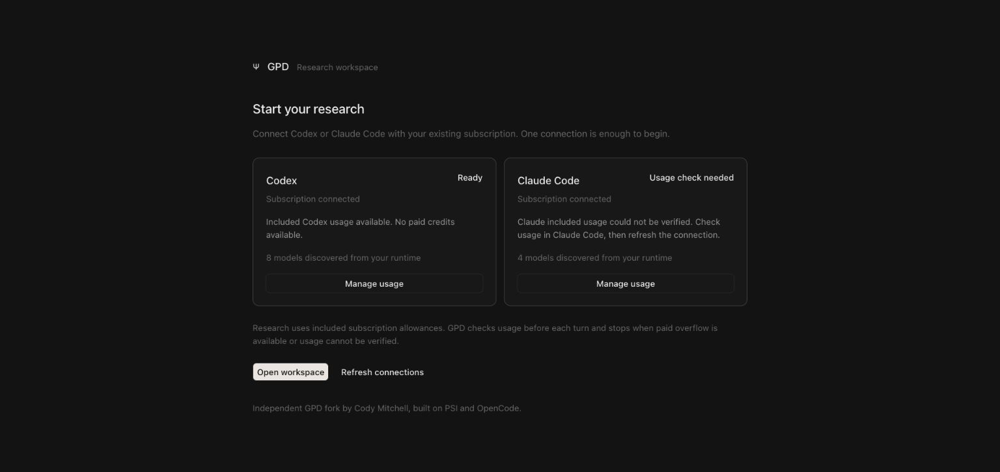
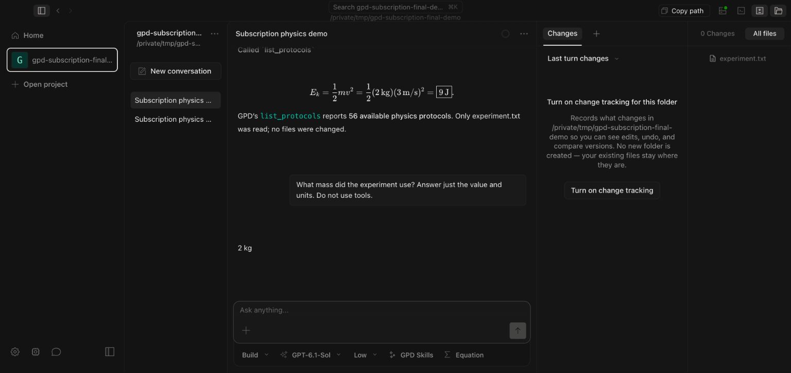

# Subscription connections

This independent GPD fork connects the research workspace to local Codex and Claude Code runtimes. Work started October 2, 2026. PSI and the OpenCode contributors authored the original app. This prototype does not imply PSI acceptance or endorsement.

## Use the app

1. Install Codex or Claude Code from the official provider if it is not already installed. The welcome screen links to each provider's installation instructions.
2. Open GPD. Existing subscription logins are detected. Otherwise choose Connect and finish the official provider sign in page. Credentials remain managed by that runtime.
3. Open the workspace, select a project folder and choose a discovered model. GPD research commands and configured local MCP tools are passed to the selected runtime.
4. Review tool approvals in the conversation. Stop cancels the owned turn. Conversations and native session identifiers are saved locally for resume.
5. Reopen AI connections from the sidebar or Settings to refresh accounts, models and usage readiness. Exploring the workspace does not require a PSI key or an active connection.

The current Mac artifact is a local development bundle, not a signed downloadable release. The repository's original installer links still install PSI's distribution.

## Build

Use Bun 1.3.11, Rust and the native prerequisites documented in `packages/desktop/README.md`. The terminal dependency is pinned to its original locked commit.

```sh
bun install --frozen-lockfile
cd packages/desktop
RUST_TARGET=aarch64-apple-darwin OPENCODE_CHANNEL=interview bun run predev
RUST_TARGET=aarch64-apple-darwin OPENCODE_CHANNEL=interview CARGO_BUILD_JOBS=4 bun run tauri build --debug --bundles app
```

The Apple Silicon bundle is `packages/desktop/src-tauri/target/debug/bundle/macos/GPD Dev.app`. Windows, Linux and Intel Mac have not been verified in this change. Existing development processes are preserved.

## Architecture

* Codex uses the installed official `codex app-server` over owned stdio JSON RPC. Claude uses Agent SDK 0.3.282 with the installed, unmodified Claude Code executable.
* The authenticated local GPD server exposes connection status and official login handoffs. Model IDs and reasoning options come from the runtime catalog, not a static API price table.
* Each research turn checks account identity and included usage before sending input. Native thread IDs are scoped to a hashed account identity and the GPD session. Switching accounts cannot silently resume another account's native thread.
* Native events enter the existing GPD message store, streamed UI, permission and question services. Runtime loss is reported without replaying an uncertain turn. Reverting or switching provider reconstructs visible conversation context in a new native thread.
* Local GPD MCP servers are supplied explicitly. Codex's other configured MCP servers are disabled for these threads. Plan mode uses a read only native policy and disables external MCP tools because those processes do not inherit the model runtime's filesystem sandbox.
* Codex retains its official runtime's local instructions. GPD also passes its existing agent, command and project instructions. Tools remain subject to the native sandbox and GPD approval flow.
* Desktop startup enables `GPD_SUBSCRIPTION_ONLY=1`. API provider routing is refused, PSI key and consent panels are replaced, and PSI session logging is disabled. The legacy engine path remains available outside this mode.
* LaTeX bracket delimiters from runtime answers render through the existing KaTeX pipeline. Code spans and fenced code remain unchanged.

## Included usage policy

Authentication and model visibility are separate from billing readiness. Codex must affirm ordinary usage and report no paid credits or unlimited credit access. Claude must return usable plan limits and explicitly disabled extra usage. Unknown metadata, API authentication, enabled paid overflow and exhausted allowances stop inference. Fast or paid service tiers are not selected. There is no API fallback or automatic credit purchase.

Provider metadata is experimental and can change. GPD deliberately stops when it cannot verify this policy. Runtime and provider account settings remain owned by the user. A provider catalog is an available selection, not a promise of unlimited usage.

## Verification on October 2, 2026

* All eight workspace typechecks pass. The new adapter, policy and real permission cleanup tests pass, 26 tests. Math delimiter tests pass, two tests. Desktop setup tests pass, seven tests.
* CLI sidecar and Apple Silicon native app bundle build successfully. The final browser UI was exercised against the local engine. The desktop control service timed out opening the packaged native window, so final packaged window acceptance remains pending.
* Live Codex testing verified fresh included usage with paid credits unavailable, streaming, a two turn remembered marker, approved local file access, GPD `list_protocols` with 56 protocols, a 9 J kinetic energy calculation and a resumed answer of 2 kg. Tokens and native tools are recorded in GPD history.
* Both installed runtime accounts authenticate and return model catalogs. Claude's current report says `rate_limits_available: true` with `rate_limits: null`; it is blocked before receiving a prompt. A completed live Claude research turn is not claimed.
* Cancellation with concurrent pending approvals was reproduced and fixed. A real permission service regression verifies that all sibling requests clear while another conversation's requests remain pending.
* The broader backend comparison has 28 failures shared with the unchanged base, with no new failure names. The base has one additional intermittent failure. The app suite has the same 20 failures on the base and branch. These suites are not fully passing; baseline logs are retained locally.
* Provider login completion on a newly signed out account, native packaged window acceptance, signed distribution, Windows and Linux remain unverified. No credential reset or paid usage was performed.

## Evidence





Official integration references:

* https://learn.chatgpt.com/docs/app-server
* https://code.claude.com/docs/en/headless
* https://code.claude.com/docs/en/legal-and-compliance
* https://support.claude.com/en/articles/15036540-use-the-claude-agent-sdk-with-your-claude-plan
